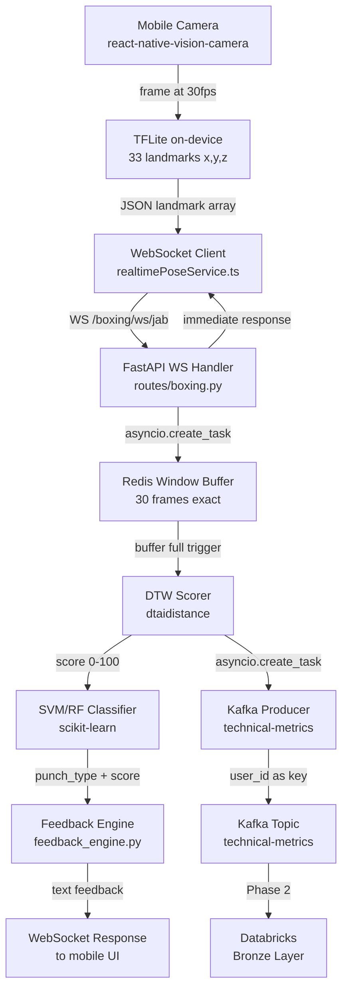
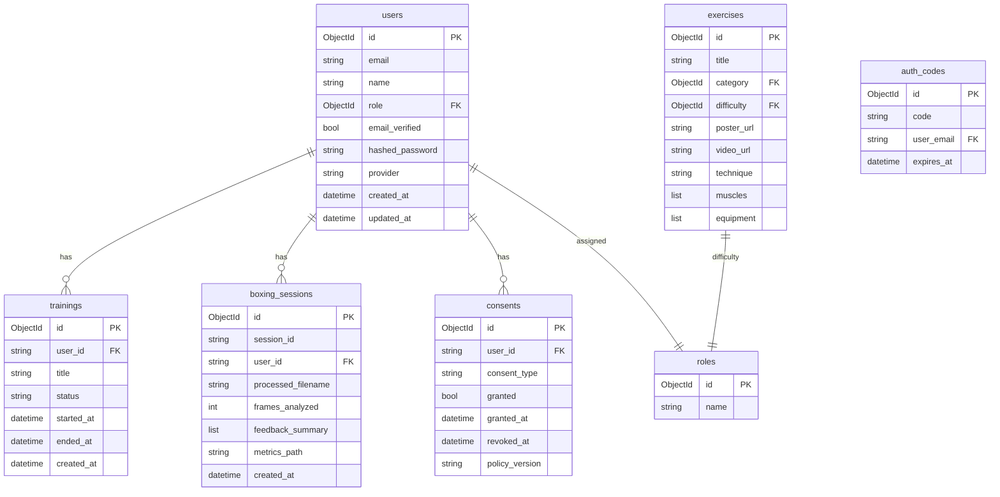
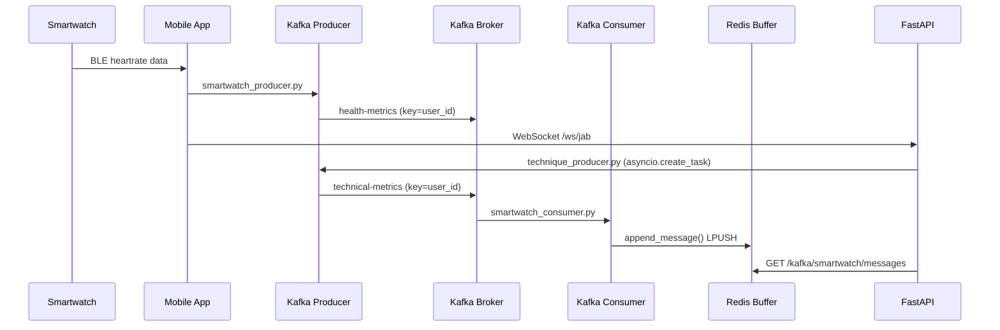
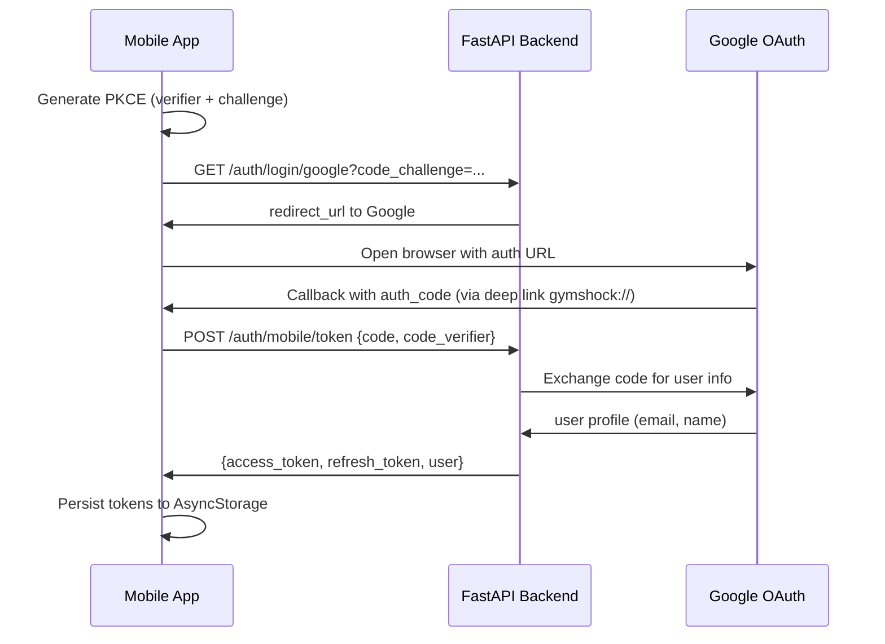
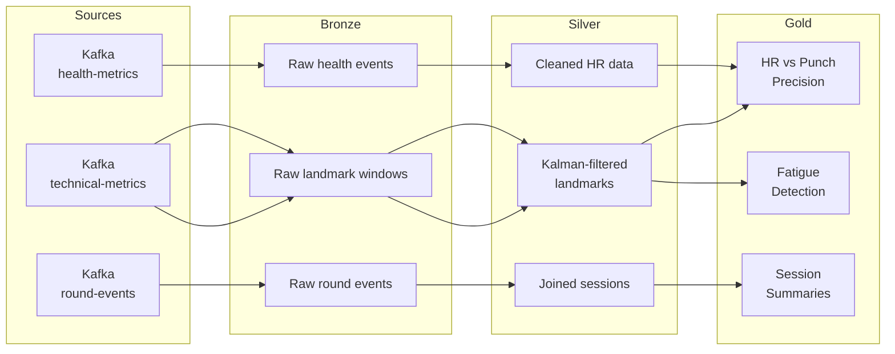

# Architecture Diagrams — mobile-boxing-app

## Output location
All diagrams go in `docs/diagrams/<category>/`:
```
docs/diagrams/
├── architecture/     # System-level diagrams
├── data/             # ERDs, data flows
├── sequences/        # Request/response flows
└── pipelines/        # ML, ETL pipelines
```

## 1. Real-time inference pipeline



## 2. MongoDB Collections ERD



## 3. Kafka event flow



## 4. Authentication flow (Google PKCE)



## 5. Medallion data architecture (Phase 2)



## Conventions for new diagrams
- Use exact component names from the codebase (not generic names)
- Include file paths where relevant
- For sequence diagrams: show the data format at each step
- For ERDs: include index fields, mark FK relationships
- Save as `docs/diagrams/<category>/<name>.md` with the mermaid block
