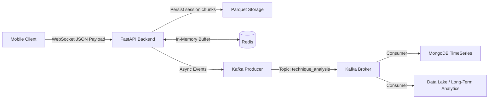

```mermaid
flowchart LR
    A[Mobile Client] -->|WebSocket JSON Payload| B[FastAPI Backend]
    B -->|Persist session chunks| E[Parquet Storage]
    
    B <-->|In-Memory Buffer| C[(Redis)]
    
    B -->|Async Events| D[Kafka Producer]
    D -->|Topic: technique_analysis| F[Kafka Broker]
    
    F -->|Consumer| G[MongoDB TimeSeries]
    F -->|Consumer| H[Data Lake / Long-Term Analytics]
```
