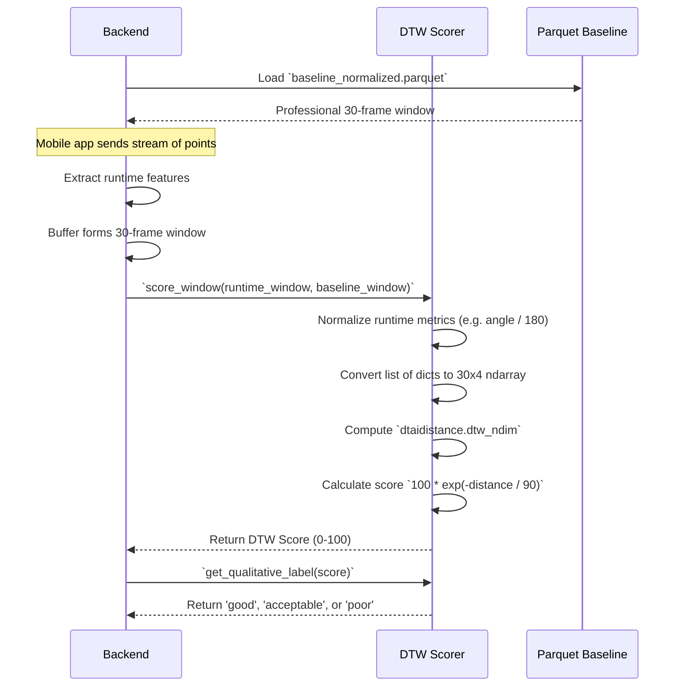

```mermaid
sequenceDiagram
    participant B as Backend
    participant D as DTW Scorer
    participant P as Parquet Baseline
    
    B->>P: Load `baseline_normalized.parquet`
    P-->>B: Professional 30-frame window
    
    Note over B: Mobile app sends stream of points
    
    B->>B: Extract runtime features
    B->>B: Buffer forms 30-frame window
    
    B->>D: `score_window(runtime_window, baseline_window)`
    D->>D: Normalize runtime metrics (e.g. angle / 180)
    D->>D: Convert list of dicts to 30x4 ndarray
    D->>D: Compute `dtaidistance.dtw_ndim`
    D->>D: Calculate score `100 * exp(-distance / 90)`
    D-->>B: Return DTW Score (0-100)
    
    B->>D: `get_qualitative_label(score)`
    D-->>B: Return 'good', 'acceptable', or 'poor'
```
