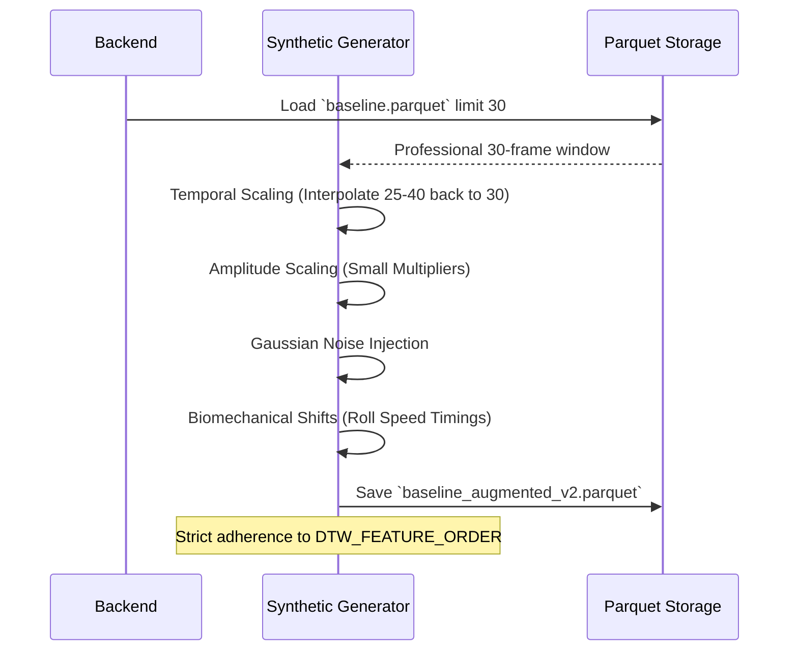

```mermaid
sequenceDiagram
    participant B as Backend
    participant Generator as Synthetic Generator
    participant P as Parquet Storage
    
    B->>P: Load `baseline.parquet` limit 30
    P-->>Generator: Professional 30-frame window
    
    Generator->>Generator: Temporal Scaling (Interpolate 25-40 back to 30)
    Generator->>Generator: Amplitude Scaling (Small Multipliers)
    Generator->>Generator: Gaussian Noise Injection
    Generator->>Generator: Biomechanical Shifts (Roll Speed Timings)
    
    Generator->>P: Save `baseline_augmented_v2.parquet`
    Note over Generator: Strict adherence to DTW_FEATURE_ORDER
```
